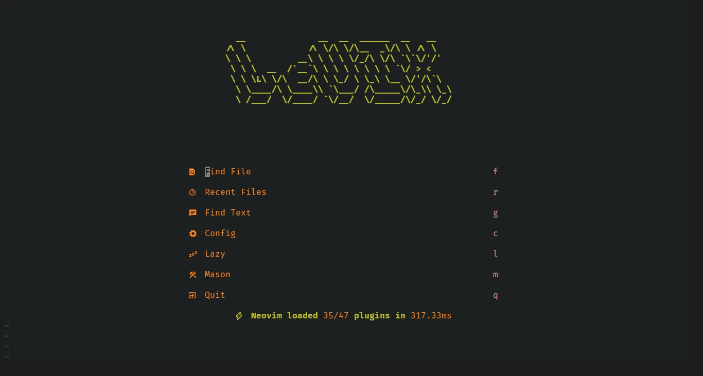

# LeVIX



> A handcrafted Neovim IDE built from scratch — every line written with purpose.


---

## What is LeVIX?

LeVIX is not a distribution. It's a personal Neovim configuration built from zero — no LazyVim, no NvChad, no shortcuts. Every plugin was chosen, every keymap was set, every line was written and understood.

Built by a developer learning Java, competing in Codeforces, and refusing to use an IDE he doesn't control.

---

## Features

- **LSP** - Java (jdtls), Python (pyright), C/C++ (clangd), Lua
- **Completion** - blink.cmp with LuaSnip snippets
- **Debugger** - nvim-dap with UI for Python, C/C++, Java
- **Formatter** - conform.nvim (format on save)
- **Linter** - nvim-lint (lint on save)
- **Git** - gitsigns + lazygit integration
- **Fuzzy Finder** - Telescope with fzf
- **File Explorer** - Neo-tree
- **Terminal** - Toggleterm (float, horizontal, vertical)
- **Navigation** - Harpoon, Flash.nvim
- **Sessions** - auto-session
- **UI** - Gruvbox, lualine, bufferline, noice, indent lines, colorizer
- **Competitive Programming** - code runner for Java, Python, C, C++
- **Tag Bar** - Show code outline by sidebar
- **Zen Mode** - Code Like A Ghost  (WOOH!)
- **OIL Explorer** - Edit Your Explorer Like a Code
- **Spectre** - Edit Like A Pro
---

## Structure

```
~/.config/nvim/
├── init.lua
├── lua/
│   ├── config/lazy.lua
│   ├── core/keymaps.lua
│   └── plugins/        
│       ├── breadcrumbs, colorscheme, completion, competitive
│       ├── cosmetics, debugger, effects
│       ├── formatter, git, harpoon
│       ├── indent, java-dap, linter
│       ├── lsp, navigation, Oil, rainbow, session
│       ├── spectre, tagbar, telescope, terminal, todo
│       ├── treesitter, ui, utilities
│       └── which-key, zen
```

---

---

## Key Bindings

| Key | Action |
|-----|--------|
| `Space+ff` | Find Files |
| `Space+fs` | Search Text |
| `Space+e` | Toggle Explorer |
| `Space+gg` | LazyGit |
| `Space+rc` | Run Code |
| `Space+rf` | Run File |
| `Space+db` | Toggle Breakpoint |
| `Space+du` | Toggle Debug UI |
| `Space+ha` | Add to Harpoon |
| `Space+hh` | Harpoon Menu |
| `Space+ss` | Save Session |
| `Space+sr` | Restore Session |
| `Space+w` | Save File |
| `Space+q` | Quit |
| `Space+co` | Code Outline |
| `Space+z` | Zen Mode |
| `Space+o` | Oil Explorer |
| `Space+S` | Toggle Spectre |
| `F5` | Debug Continue |
| `F10` | Step Over |
| `F11` | Step Into |
| `Tab` | Next Buffer |
| `S-Tab` | Prev Buffer |

---

## 📋 Requirements & Prerequisites

To ensure **LeVIX** runs flawlessly with all its features (LSP, Autocomplete, Treesitter, and Fuzzy Finding), your system must have the following dependencies installed:

### 1. Core Editor
* **Neovim >= 0.10.0** (Compiled with Lua support)
* **Git** (Required by `lazy.nvim` to clone and update plugins)

### 2. System Utilities (Required for Telescope & Core Tools)
* **ripgrep (`rg`)**: Essential for ultra-fast text searching inside files.
* **fd-find (`fd`)**: Required for fast file searching and navigation.
* **curl**: Needed by `mason.nvim` to download and install LSP servers.
* **unzip / tar**: Required to extract downloaded LSP packages.

### 3. Build Tools (Required for Compiling Treesitter Parsers)
* **C Compiler** (`gcc` or `clang`)
* **make**

### 4. Language Runtimes (For LSPs, Formatters & Debuggers)
* **Node.js & npm**: Required for most web and scripting LSPs (like Pyright, TS/JS, Bash).
* **Python 3 & pip**: Required for Python development tools.
* **Java Development Kit (JDK >= 17)**: Required to run the Java LSP (`jdtls`).

### 5. Terminal & UI Visuals (Crucial)
* A **Nerd Font** must be installed and active in your terminal emulator (e.g., *JetBrainsMono Nerd Font*, *FiraCode Nerd Font*, or *Iosevka Nerd Font*). Without a Nerd Font, file icons, dashboard logos, and statusline symbols will render as broken squares.

---

## Install

```bash
# Backup your existing config
mv ~/.config/nvim ~/.config/nvim.bak

# Clone LeVIX
git clone git@github.com:Ledev0/LeVIX.git ~/.config/nvim

# Open Neovim and let lazy.nvim install everything
nvim
```

---

## 📄 License

This project is licensed under the MIT License - see the [LICENSE](LICENSE) file for details.

Copyright (c) 2026-present Seif Amr [Ledev0]

*Built with 🔥 by [Ledev0](https://github.com/Ledev0)*
